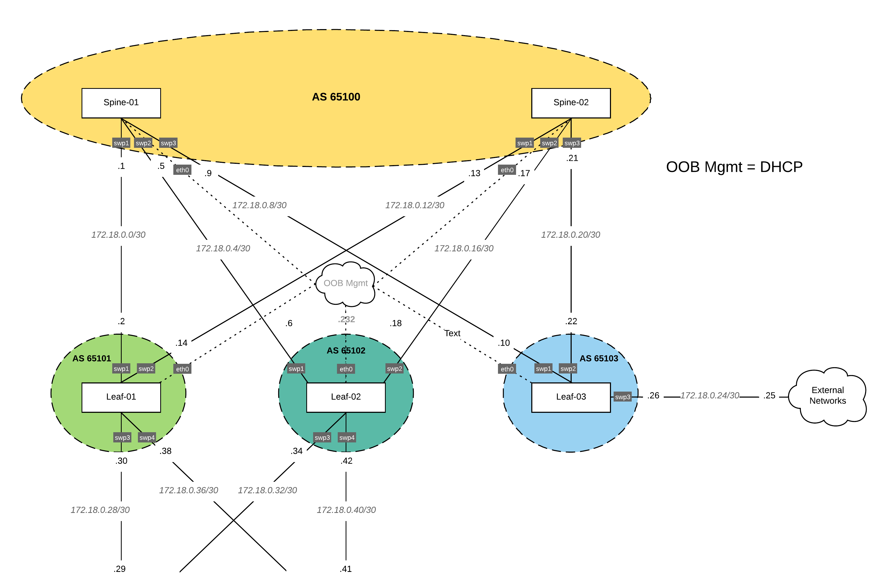

# Ansible lab01 Deploying Cumulus Linux Network Fabric

# Table of contents
1. [Topology description](#topology_description)
2. [Ansible configuration](#ansible_configuration)

Topology description  
--------------------
This lab was built using Eve-NG and Cumulus Linux qcow2 images:

| hostname      | IP           | Switch - Version   |
| :------------ |:-------------| :------------------|
| spine-01      | DHCP         | Cumulus VX - 3.7.7 |
| spine-02      | DHCP         | Cumulus VX - 3.7.7 |
| leaf-01       | DHCP         | Cumulus VX - 3.7.7 |
| leaf-02       | DHCP         | Cumulus VX - 3.7.7 |
| leaf-03       | DHCP         | Cumulus VX - 3.7.7 |

DHCP reservation was used for the switch mangement interfaces feel free to use static IP address if DHCP isn't an options. Also make sure you can resolve hostnames or use IP addresses in the hosts inventory file.  

Ansible configuration  
----------------------

| File             | Description                                                       |
| :--------------- | :---------------------------------------------------------------- |
| ansible.cfg      | Ansible configuration file                                        |
| hosts            | Inventory of all switches                                         |
| roles            | Utilizing Roles instead of a large yml file                       |
| group_vars       | Global variables for this lab                                     |
| group_vars/vault | Stores the changed switch password. Recreate for your environment |

